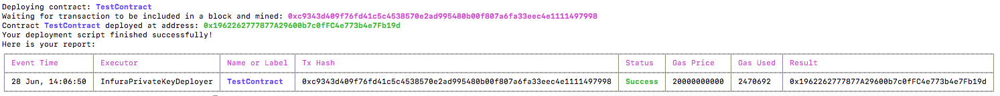

[](https://badge.fury.io/js/etherlime) 
[](https://travis-ci.org/LimeChain/etherlime)
[](https://codecov.io/gh/LimeChain/etherlime)
[](https://etherlime.readthedocs.io/en/latest/?badge=latest)
[](https://gitter.im/lime-tech-talks/Lobby)


# etherlime

**etherlime** is an ethereum development and deployment framework based on [ethers.js](https://github.com/ethers-io/ethers.js/).

This framework provides alternative to the other web3.js based frameworks and allows for ultimate control by the developer. It also adds much needed verboseness in the deployment process so that you can be aware of what is really going on (as opposed to the general shooting in the dark technique).

This framework was born out of necessity, hardships and trouble in the development and deployment of ethereum smart contract. We are trying to ease the pain of deployment, compilation and unit testing and add much needed stability to the process. In our mind ethers is much more stable alternative than web3.js for the moment therefore this framework is born.

**Milestones:**
1. [Ready]Being able to deploy compiled contracts (compiled in the truffle format) on local and infura nodes <---- Done
2. [Ready]Being able to compile contracts to the desired formats for deployment <---- Done
3. [Not Ready]Being able to run unit tests on the compiled contracts <---- We are here

## Installing

```
npm i -g etherlime
```

## Documentation

[Documentation](https://etherlime.readthedocs.io/en/latest/)

## Running embedded ganache-cli

```
etherlime ganache
```

## Setting up your project to deploy with etherlime

```
etherlime init
```
This will create `contracts` directory and `deployment` directory with `deploy.js` file inside. You can use this file to write your deployment procedure.

## Compiling

```
etherlime compile [dir] [runs]
```

* ``dir`` - [Optional] By specifying ``dir`` you can set the root directory where to read the contracts and place the build folder. By default ``dir`` is set to the current working directory ``./``
* ``runs`` - [Optional] By specifying ``runs`` between 1 and 999 you enabled the optimizer and set how many times the optimizer will be run. By default the optimizer is not enabled.

## Deploying

In order to deploy your deployment file following command:
```
etherlime deploy [file] [network] [secret] [-s]
```

* ``file`` - [Optional] By specifying ``--file`` you can use another file as long as you keep the structure of the file (exporting an ``async deploy`` function with ``network`` and ``secret`` params)
* ``network`` - [Optional] By specifying ``--network`` you can specify the network param to be passed to your deploy method
* ``secret`` - [Optional] By specifying ``secret`` you can specify the secret param to be passed to your deploy method. Comes in very handy for passing private keys.
* ``-s`` - [Optional] Silent - silences the verbose errors 

The deployment process is verbose and gives you real-time info about the performed actions. In addition there is a report of the actions when the deployment finishes (as not all of us monitor the deployment process constantly);

### History of your deploys
In order to see a list of what you've deployed you can run the following command:
```
etherlime history
```

## Quick Deployer Example

```
const etherlime = require('etherlime');

const TestContract = require('./TestContract.json');

const defaultConfigs = {
	gasPrice: 20000000000,
	gasLimit: 4700000
}

const deploy = async (network) => {

	const deployer = new etherlime.InfuraPrivateKeyDeployer('Your Private Key Goes Here', 'ropsten', 'Your Infura API Key', defaultConfigs);
	
	const result = await deployer.deploy(TestContract, '0xda8a06f1c910cab18ad187be1faa2b8606c2ec86', 1539426974);
}

```

Result of `etherlime deploy` would be something like this:
[](https://imgur.com/a/NyLX9mH)

# License
Completely MIT Licensed. Including ALL dependencies.