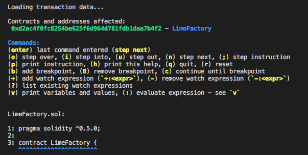

etherlime debug
***************

In order to debug transaction, you will need the following:

* The transaction hash of a transaction on your desired blockchain.
* The source code of contract that transaction is executed from.

Syntax
------

::

    etherlime debug <txHash> [port]

Parameters:

* ``txHash`` - Transaction hash of the transaction on your desired blockchain.
* ``port`` - [Optional] The port that the etherlime ganache is runing. Defaults to 8545.

Using the command will start the debugger interface with the following information:

* List of addresses involved or created during the cycle of the transaction passed in.
* List of available commands for using the debugger.
* The entry point of the transaction, including code preview and the source file.

Available Commands
------------------

The enter key is sending to the debugger the last command that is entered. After the initial start of the debugger, the enter key is set to step to the next logical source code element (the next statement or expression that is evaluated by the EVM). You can use n or enter initially.

	* ``(o) step over`` Steps over the current line, relative to the position of the statement or expression currently being evaluated in the Solidity source file. Use this command if you don't want to step into a function call or contract creation on the current line, or if you'd like to quickly jump to a specific point in the source file
	* ``(i) step into`` Steps into the function call or contract creation currently being evaluated. Use this command to jump into the function and quickly start debugging the code that exists there.
	* ``(u) step out`` Steps out of the currently running function. Use this command to quickly get back to the calling function, or end execution of the transaction if this was the entry point of the transaction.
	* ``(n) step next`` Dteps to the next logical statement or expression in the source code. For example, evaluating sub expressions will need to occur first before the virtual machine can evaluate the full expression. Use this command if you'd like to analyze each logical item the virtual machine evaluates.
	* ``(;) step instruction`` Allows you to step through each individual instruction evaluated by the virtual machine. This is useful if you're interested in understanding the low level bytecode created by the Solidity source code. When you use this command, the debugger will also print out the stack data at the time the instruction was evaluated.
	* ``(p) print instruction`` Prints the current instruction and stack data, but does not step to the next instruction. Use this when you'd like to see the current instruction and stack data after navigating through the transaction with the logical commands described above.
	* ``(h) print help`` Print the list of available commands.
	* ``(q) quit`` Print the list of available commands.
	* ``(r) reset`` Reset the debugger to the beginning of the transaction.
	* ``(b) add a breakpoint`` Set breakpoints for any line in any of your source files (see examples below). These can be given by line number; by relative line number; by line number in a specified source file; or one may simply add a breakpoint at the current point in the code.
	* ``(B) remove a breakpoint`` Remove any of your existing breakpoints.
	* ``(B all) remove all breakpoints`` Remove all of your existing breakpoints.
	* ``(c) continue to breakpoint`` Cause execution of the code to continue until the next breakpoint is reached or the last line is executed.
	* ``(+:) add watch expression`` Add a watch on a provided expression, for example: ``+:limes``
	* ``(-:) remove watch expression`` Remove a watch on a provided expression, for example: ``-:limes``
	* ``(?) list existing watch expressions`` Display a list all the current watch expressions.
	* ``(v) display variables`` Display the current variables and their values.

Here is example of runned debugger with txHash:

|Runned Debugger|

-----

